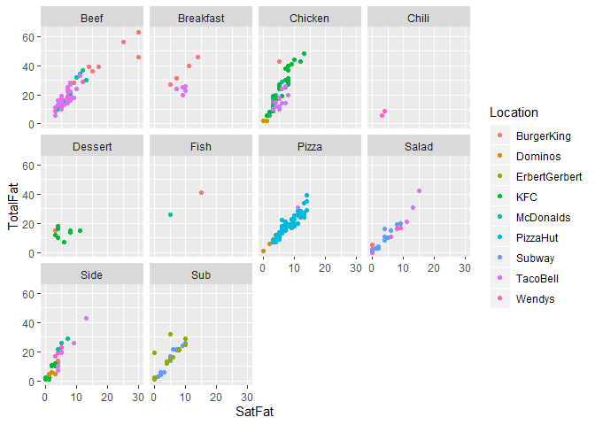

R Markdown
----------

``` r
library(ggplot2)
```

    ## Warning: package 'ggplot2' was built under R version 3.6.2

``` r
NutritionData = NutritionData <- read.csv("C:/Users/fb8502oa/Desktop/Github stuff/TRIAL-/NutritionData.csv")
#View(NutritionData1)
 names (NutritionData)
```

    ##  [1] "Location"      "ItemName"      "Type"          "Calories"     
    ##  [5] "TotalFat"      "SatFat"        "Cholesterol"   "Sodium"       
    ##  [9] "Carbohydrates" "Fiber"

``` r
 str(NutritionData)
```

    ## 'data.frame':    307 obs. of  10 variables:
    ##  $ Location     : Factor w/ 9 levels "BurgerKing","Dominos",..: 1 1 1 1 1 1 1 1 1 1 ...
    ##  $ ItemName     : Factor w/ 305 levels "6BMT","6ColdCutTrio",..: 302 305 102 103 303 304 140 56 97 98 ...
    ##  $ Type         : Factor w/ 10 levels "Beef","Breakfast",..: 1 1 1 1 1 1 1 1 1 1 ...
    ##  $ Calories     : int  640 730 870 960 420 460 330 380 600 640 ...
    ##  $ TotalFat     : int  39 46 56 63 24 28 15 19 36 39 ...
    ##  $ SatFat       : int  14 30 25 30 7 9 5 8 15 17 ...
    ##  $ Cholesterol  : int  90 115 170 195 60 75 55 65 135 145 ...
    ##  $ Sodium       : int  870 1350 940 1420 530 770 530 770 1060 1240 ...
    ##  $ Carbohydrates: int  45 46 45 46 29 29 28 28 28 28 ...
    ##  $ Fiber        : int  3 3 3 3 2 2 1 1 1 1 ...

``` r
#question 4
#4. Create a scatterplot of total fat by saturated fat for each type.  Also, color the points according to location.
ggplot(data=NutritionData)+
  geom_point(mapping = aes(x=SatFat, y=TotalFat,color=Location))+
  facet_wrap(. ~ Type, ncol=4)
```


